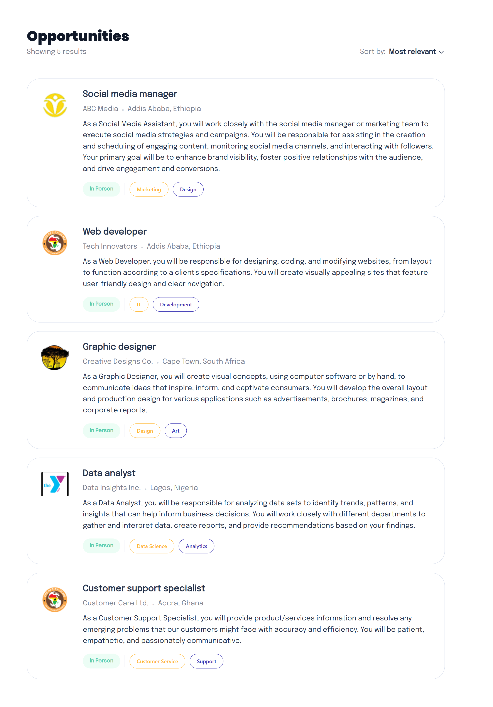
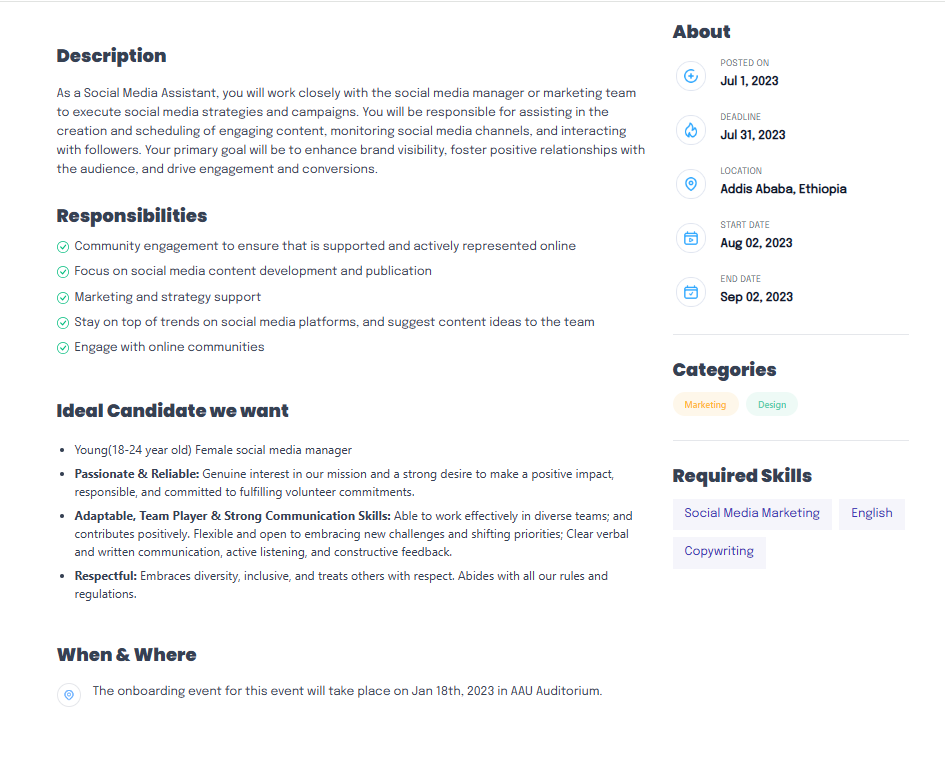

# Job Listing App

A modern job listing application built with Next.js, React, and Tailwind CSS.

## Features

- Browse job listings
- View detailed job descriptions

## Screenshots

### Landing Page / Job List

### Applicant Dashboard / Job Description

## Run

1. Clone or download this repository.

2. Install dependencies: `npm install`

3. Start the development server: `npm run dev`

4. Open your browser to the URL shown in the terminal (usually http://localhost:3000).
